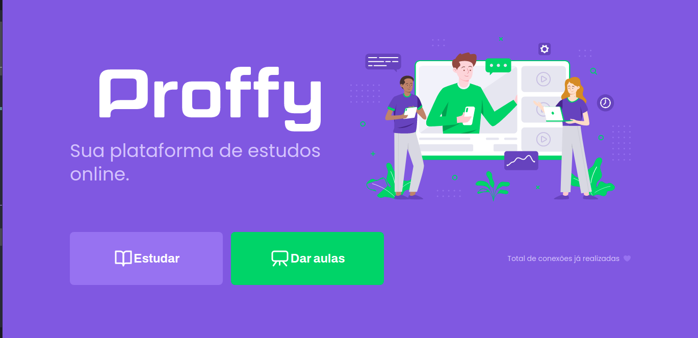

## Welcome! 👋
## Next-Level-Week2

 * This is one more event from Rocketseat to teaching beginners programers to grow up in your career and up your level experience in development area.

**IN THIS PROJECT THE TECHNOLOGIES, FRAMEWORKS AND LIBRARIES BELOW WERE USED**

| JAVASCRIPT | TYPESCRIPT | JSON | HTML | CSS | REACT | SQLILTE3 | CORS | 
| ---------- | ---------- | ---- | ---- | --- | ----- | -------- | ---- |

Thanks for checking out this front-end coding challenge.
Click <a href="https://proffy-neon.vercel.app/" target="_blank">here</a> if you wanna see the Degsiner and routes working.

