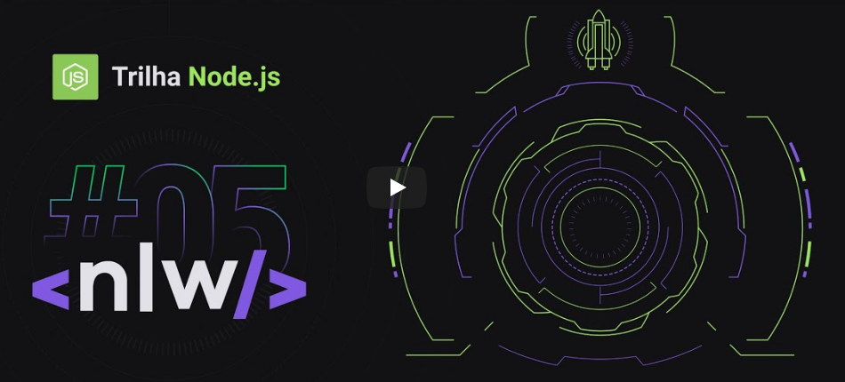

## STEP BY STEP of CLASSES

**CLASS01**

**First of all, you need to install some libraries.**

1- Start setting the command [yarn init -y]

2- Installing express > [ yarn add express AND yarn add @types/express -D]

3- Installing typescript > [ yarn add typescript -D ] before that create the tsconfig type the 
command> [ yarn tsc --init ] after that alter the line 28 changing the value of STRICT from TRUE to FALSE.

4- Installing ts-node [ yarn add ts-node-dev -D ], after that alter the file package.json inserting:
```.json
"script": {
    "dev": "ts-node-dev src/server.ts"
  },
  ```

5- Now you'll gonna do some request and response just for testing your server.

**OBS** > The first code of the first class is MISSAOESPACIAL

**CLASS02**

6- Install sqlite for database > [ yarn add typeorm reflect-metadata sqlite3]

7- Creating migrations > [ yarn typeorm migration:create -n CreateSettings ]
** After to coder settings about your fist migration > set [yarn typeorm migration:run ] on command line.

8- Installing lib UUID > [ yarn add uuid AND yarn add @types/uuid -D]


9- Unable the settings from tsconfig.json taking off the comments of: 
```json
"experimentalDecorators": true,
"emitDecoratorMetadata": true, 
```

**OBS** The first code of the first class is"EMBUSCADOPROXIMONIVEL"

**CLASS03**

10- yarn typeorm migration:create -n CreateUsers
11- yarn typeorm migration:create -n CreateMessages


**OBS** > The first code of the first class is "ASTRONAUTAS"


**CLASS04**

*Protocol HTTP*

- Client send a request to the Servidor and waitting for the response.

*Protocol WS/ Websocket*

- When the client make a connection with server you give a generation of websocket like a ID.

A little example about connection from websocket.

```js
io.on('connection', socket => {
  socket.emit('request', /* … */); // emit an event to the socket
  io.emit('broadcast', /* … */); // emit an event to all connected sockets
  socket.on('reply', () => { /* … */ }); // listen to the event
});
```

12- Start to install the socket.io with command > [ yarn add socket.io / ]

13- Types > yarn add @types/socket.io -D

14- EJS and socket.io-client > yarn add ejs / yarn add socket.io-client

* Creating the table of connections by foraign keys

15- Set command on terminal > [ yarn typeorm migration:create -n CreateConnections ]
* After configure the queryRunner of foreignKey > yarn typeorm migration:run

**OBS** > The first code of the first class is "O UNIVERSO É INFINITO"
